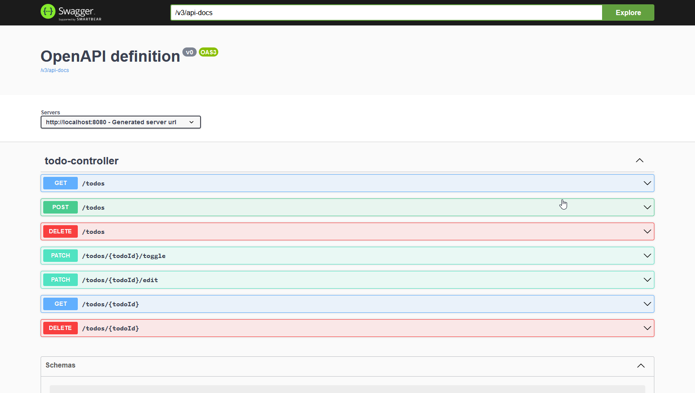

# Simple Spring To-do REST API

## Setting up

Everything necessary for building should be acquired by Gradle.  
Dependencies used:
````
implementation 'org.springframework.boot:spring-boot-starter-data-jpa'
implementation 'org.springframework.boot:spring-boot-starter-web'
implementation 'org.springdoc:springdoc-openapi-starter-webmvc-ui:2.1.0'
runtimeOnly 'com.h2database:h2'
testImplementation 'org.springframework.boot:spring-boot-starter-test'
````
Temurin-17 OpenJDK was used to develop this.

## Starting the application

Clone the project and use the wrapped Gradle to run.  
In project root folder run command
````
./gradlew bootRun
````

All the needed dependencies should be taken care by Gradle. Once server is running Swagger can be accessed from http://localhost:8080/swagger-ui.html


## Using the API
**Possible requests**  
> GET `/todos`  
> Returns all Todos
 

> GET `/todos/{todoId}`  
> Request returns a Todo with this Id if it exists

> POST `/todos`  
> Adds a new Todo to database  
> Request returns the Todo

> DELETE `/todos`  
> Empty database of all Todos  
> Request returns nothing

> DELETE `/todos/{todoId}`  
> Delete a Todo with this Id if it exists  
> Request returns nothing

> PATCH `/todos/{todoId}/toggle`  
> Toggles a Todo's *completed* boolean field  
> Request returns the patched Todo

> PATCH `/todos/{tdoId}/edit`  
> To change Todo description  
> Request returnes the patched Todo




## What could be done better?  
- **Error handling**  
When client requests for an element which does not exist in the repository, then they're given Error 500 instead of 404. Proper error handling for an API is a must.
- 